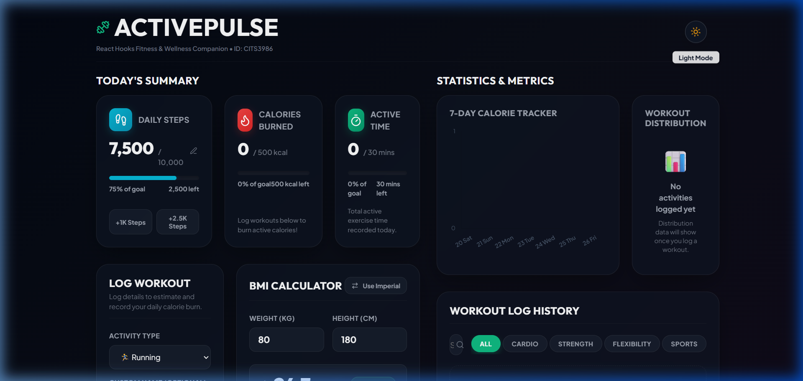
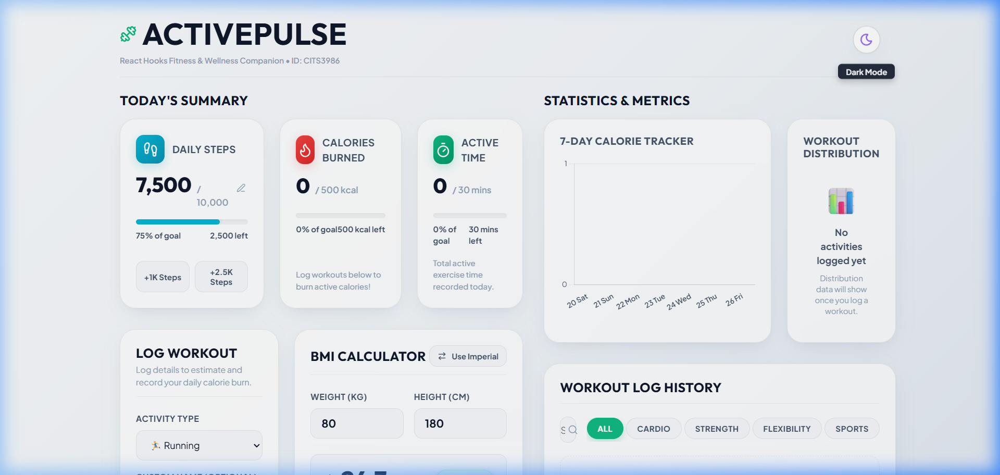

# ActivePulse - Fitness Tracker (React Hooks)

ActivePulse is a comprehensive, high-fidelity fitness tracking web application built using functional React.js components and advanced custom React hooks. It allows users to set daily fitness goals, log workout activities with real-time MET calorie estimations, compute Body Mass Index (BMI), view weekly trends with interactive Chart.js widgets, and persist all activity history locally.



## 🚀 Live Demo

[View Live Application](https://cits3986-activepulse.netlify.app/)

## 📌 Table of Contents

- [Features](#features)
- [Tech Stack](#tech-stack)
- [Getting Started](#getting-started)
- [Project Structure](#project-structure)
- [Screenshots](#screenshots)
- [Intern Details](#intern-details)

## ✨ Features

- **Daily Progress Dashboard (P0)**: Circular progress bars tracking Steps, Calories Burned, and Active Minutes against set goals.
- **Workout Logger (P0)**: Log exercises with activity presets, duration, weight, and intensity level. Calorie burn is calculated in real time using the scientific MET formula.
- **BMI Calculator (P0)**: Metric and imperial weight/height calculator displaying real-time BMI score, color-coded health classifications, and custom medical advice.
- **Goal Settings Tracker (P0)**: Modify steps, active minutes, and calorie targets dynamically.
- **Statistics Dashboard (P0)**: Visualizes weekly progress using interactive Chart.js components (Bar chart for weekly calories, Doughnut chart for activity distribution).
- **Workout Log History (P2)**: Chronological list of logged workouts with quick deletion, search filtering, and category toggles.
- **Local Storage Persistence (P0)**: All logs, steps, goals, and weight metrics are fully synchronized and persisted across sessions.
- **Dark Mode Support (P1)**: Sleek, high-contrast dark/light mode toggle utilizing custom CSS properties and micro-animations.

## 🛠️ Tech Stack

| Technology      | Purpose                          |
|-----------------|----------------------------------|
| React           | Component architecture & hooks   |
| Vite            | Build compiler and HMR dev server|
| Chart.js        | Core visualization canvas        |
| React-Chartjs-2 | React wrappers for Chart.js      |
| Lucide React    | Clean iconography assets         |
| Plain CSS       | Unified custom styling modules   |

## 🏁 Getting Started

### Prerequisites

- Node.js v18 or higher
- npm v9 or higher
- A modern web browser with WebGL/hardware acceleration enabled

### Installation

```bash
# Clone the repository
git clone https://github.com/PranavNaikude06/Codetech.git

# Navigate to the project directory
cd Codetech/fitness-tracker-react-hooks

# Install dependencies
npm install

# Start the development server
npm run dev
```

## 📁 Project Structure

```
fitness-tracker-react-hooks/
├── public/                       # Favicon & index assets
│   └── favicon.svg
├── screenshots/                  # Documentation images
│   ├── dark_mode.png
│   └── light_mode.png
├── src/
│   ├── components/               # Custom UI blocks
│   │   ├── Dashboard/            # Goals and summaries
│   │   ├── WorkoutLogger/        # Workout forms & MET equations
│   │   ├── BMICalculator/        # BMI score and advice
│   │   ├── GoalTracker/          # Targets update forms
│   │   ├── StatsDashboard/       # Chart.js weekly and category charts
│   │   ├── ActivityHistory/      # Filters and chronological tables
│   │   └── ThemeToggler/         # Day/Night animators
│   ├── hooks/                    # Reusable custom hooks
│   │   ├── useLocalStorage.js    # Localstorage synchronization
│   │   ├── useBMI.js             # BMI category calculations
│   │   └── useTheme.js           # Stylesheet theme properties
│   ├── utils/                    # Computations
│   │   └── calorieCalculator.js  # MET calorie consumption calculations
│   ├── constants/                # Presets
│   │   └── workouts.js           # Workout MET categories and items
│   ├── styles/                   # Style definitions
│   │   └── global.css            # Custom CSS variables and style configurations
│   ├── App.jsx                   # Central state reducer and pages layout
│   ├── App.module.css            # Layout grids styling
│   └── main.jsx
├── .gitignore
├── package.json
└── README.md
```

## 📸 Screenshots

### Light Mode Dashboard


### Dark Mode Dashboard


## 👤 Intern Details

| Field          | Value                          |
|----------------|--------------------------------|
| Name           | Pranav Sachin Naikude          |
| Intern ID      | CITS3986                       |
| Organization   | CODTECH IT Solutions Pvt. Ltd. |
| Domain         | React.js Web Development       |
| Duration       | 06 June 2026 – 18 July 2026    |
