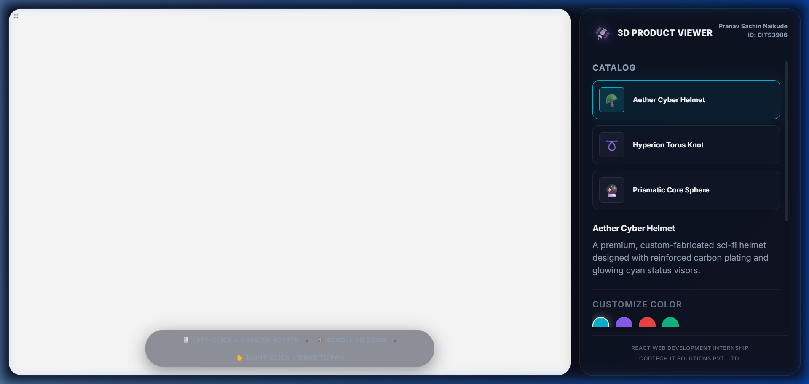
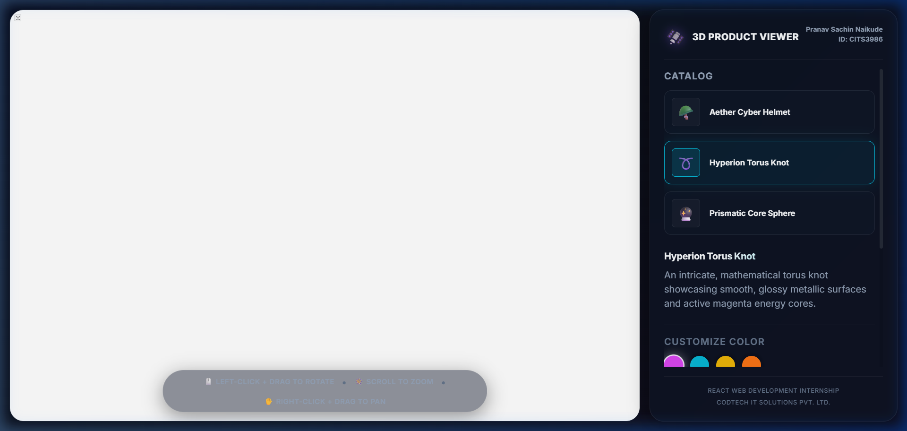
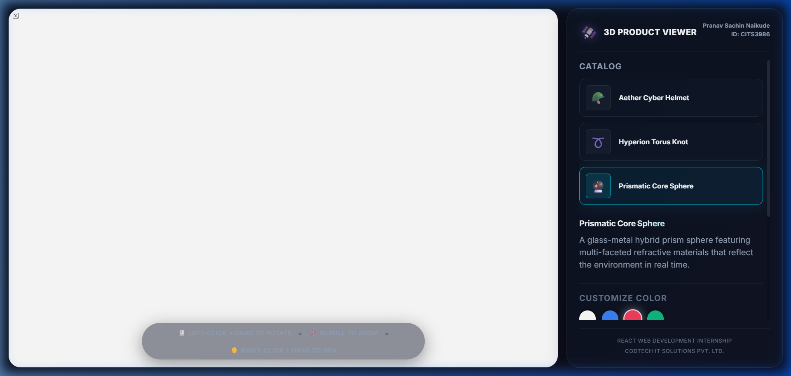

# React 3D Product Viewer

An interactive, browser-based 3D product catalog and customizer application built with React, React Three Fiber, Drei, and Three.js.



## 🚀 Live Demo

[View Live Application](https://react-3d-product-viewer-cits3986.vercel.app/)

## 📌 Table of Contents

- [Features](#-features)
- [Tech Stack](#%EF%B8%8F-tech-stack)
- [Getting Started](#-getting-started)
- [Project Structure](#-project-structure)
- [Screenshots](#-screenshots)
- [Intern Details](#-intern-details)

## ✨ Features

- **Procedural 3D Mesh Engine**: Renders high-quality futuristic models (Helmet, Torus Knot, and Prism Sphere) programmatically with custom geometry configurations.
- **Orbit Camera Controls**: Drag to rotate, scroll/pinch to zoom, and right-click drag to pan the camera viewport.
- **Custom Material Settings**: An interactive color customizer panel allowing real-time material reflections and color changes.
- **Responsive WebGL Canvas**: Adapts to any device screen (tested at 375px, 768px, and 1440px widths) with anti-aliasing and pixel ratio capping for optimum mobile frame rates.
- **Smooth Product Switching**: A clean catalog sidebar featuring immediate mesh and description updates.
- **Interactive UI Controls**: Hand-held controls for camera reset and auto-rotation toggle.
- **Sleek Cyberpunk HUD**: Hand-written glassmorphism borders, glowing highlights, and responsive side panel dividers.

## 🛠️ Tech Stack

| Technology      | Purpose                          |
|-----------------|----------------------------------|
| React.js (v18)  | Core UI framework |
| Three.js        | Core WebGL 3D rendering engine |
| React Three Fiber| Declarative React wrappers for Three.js scene creation |
| Drei            | Camera, lights, and environment map helpers |
| CSS Modules     | Native component-scoped styling |

## 🏁 Getting Started

### Prerequisites

- Node.js v18 or higher
- npm v9 or higher

### Installation

1. Clone the repository:
   ```bash
   git clone https://github.com/PranavNaikude06/Codetech.git
   cd Codetech/react-3d-product-viewer
   ```

2. Install the project dependencies:
   ```bash
   npm install
   ```

3. Start the local development server:
   ```bash
   npm run dev
   ```

4. Open the browser at `http://localhost:5173/` to interact with the 3D models.

## 📁 Project Structure

```
react-3d-product-viewer/
├── public/                       # Static public assets
│   └── favicon.svg
├── screenshots/                  # README screenshots
│   ├── home.png
│   ├── feature.png
│   └── mobile.png
├── src/
│   ├── components/               # Scoped 3D and UI elements
│   │   ├── CameraControls/
│   │   ├── ControlsHint/
│   │   ├── LoadingOverlay/
│   │   ├── ProductInfo/
│   │   ├── ProductModel/
│   │   ├── ProductSelector/
│   │   ├── SceneLighting/
│   │   └── Viewer/
│   ├── data/                     # Product catalog descriptions
│   ├── styles/                   # Global CSS variables & resets
│   ├── App.jsx                   # Layout coordinator
│   ├── App.module.css
│   └── main.jsx                  # Vite mount entry point
├── .eslintrc.cjs
├── .gitignore
├── .prettierrc
├── index.html
├── package.json
└── vite.config.js
```

## 📸 Screenshots

### Home / Helmet View


### Torus Knot Customization (Anodized Magenta)


### Prismatic Core Sphere


## 👤 Intern Details

| Field          | Value                          |
|----------------|--------------------------------|
| Name           | Pranav Sachin Naikude          |
| Intern ID      | CITS3986                       |
| Organization   | CODTECH IT Solutions Pvt. Ltd. |
| Domain         | React.js Web Development       |
| Duration       | 06 June 2026 – 18 July 2026    |
