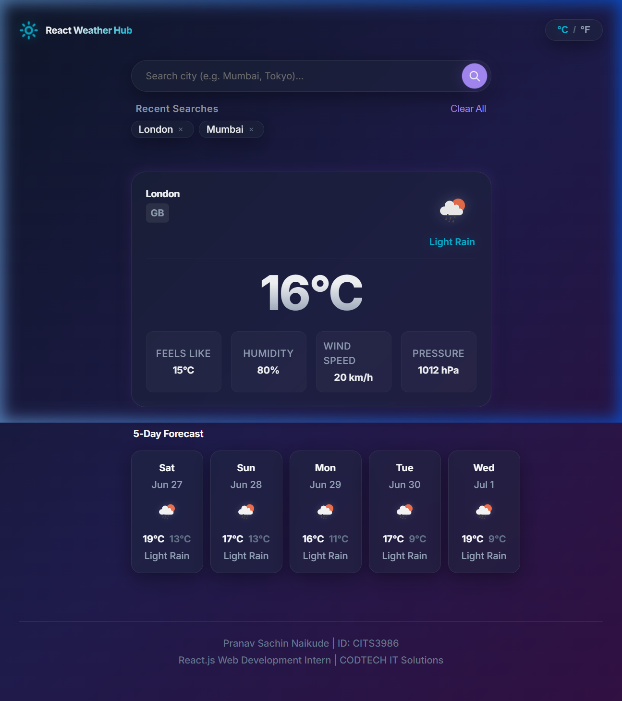
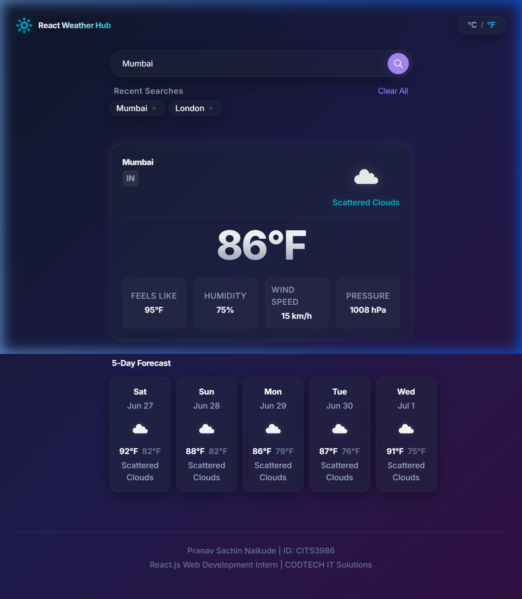
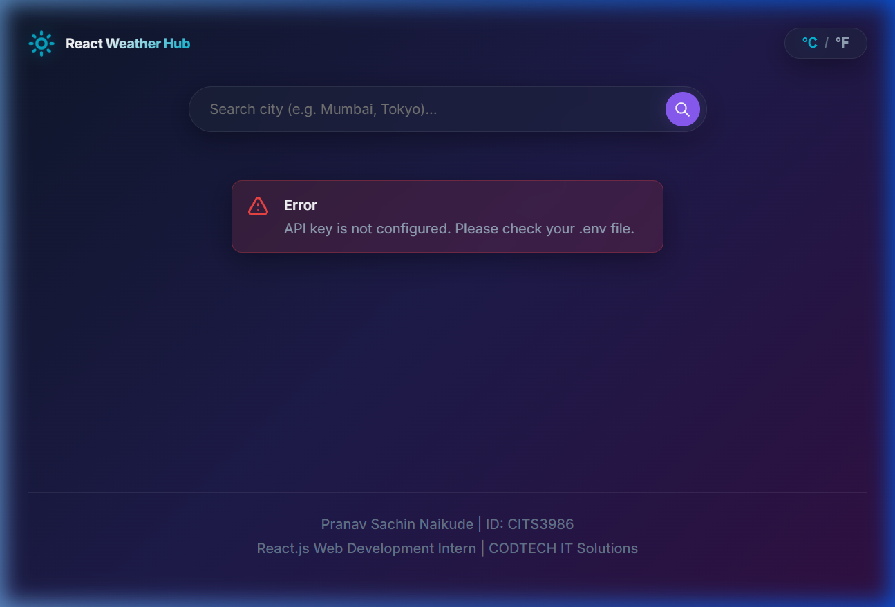

# React Weather Hub

A production-ready React.js application that provides real-time weather information and a 5-day forecast for cities worldwide.



## 🚀 Live Demo

[View Live Application](https://react-weather-hub-cits3986.vercel.app/)

## 📌 Table of Contents

- [Features](#-features)
- [Tech Stack](#%EF%B8%8F-tech-stack)
- [Getting Started](#-getting-started)
- [Environment Variables](#-environment-variables)
- [Project Structure](#-project-structure)
- [Screenshots](#-screenshots)
- [Intern Details](#-intern-details)

## ✨ Features

- **Current Weather Conditions**: View real-time temperature, condition description, humidity, wind speed, feels-like temperature, and atmospheric pressure.
- **5-Day Weather Forecast**: Displays daily forecast information with daily highs/lows and condition descriptions.
- **Vibrant CSS Glassmorphism**: Hand-written responsive layouts featuring sleek modern blur effects, harmonious color gradients, and micro-interactions.
- **Search History**: Automatically caches and displays the last 5 searched cities as clickable chips for swift re-lookup.
- **Temperature Unit Toggle**: Seamlessly convert temperature values between Celsius and Fahrenheit dynamically without triggers for redundant API requests.
- **Persistent Storage**: Utilizes native browser `localStorage` to save unit preferences and search history across sessions.
- **Demo Mode Fallback**: Works out of the box with preloaded mock data for popular cities (London, Mumbai, Tokyo, New York, Sydney) even when an API key is not configured.
- **Robust Error Mapping**: Surfaces user-friendly, descriptive warnings for network timeouts, invalid search characters, missing keys, or cities that do not exist.

## 🛠️ Tech Stack

| Technology      | Purpose                          |
|-----------------|----------------------------------|
| React.js (v18)  | Core UI framework (Functional components + Hooks only) |
| Vite            | Development server and fast production bundler |
| Axios           | HTTP requests client for fetching OpenWeatherMap APIs |
| CSS Modules     | Native CSS component-scoped styling |
| LocalStorage API| Client-side persistence of preferences & history |

## 🏁 Getting Started

### Prerequisites

- Node.js v18 or higher
- npm v9 or higher
- An OpenWeatherMap API Key (Free tier)

### Installation

1. Clone the repository:
   ```bash
   git clone https://github.com/PranavNaikude06/Codetech.git
   cd Codetech/react-weather-hub
   ```

2. Install the project dependencies:
   ```bash
   npm install
   ```

3. Create your local environment configuration:
   ```bash
   cp .env.example .env
   ```
   Open the `.env` file and insert your OpenWeatherMap API Key.

4. Start the local development server:
   ```bash
   npm run dev
   ```

## 🔐 Environment Variables

Ensure a `.env` file exists in the root of the `react-weather-hub` directory with the following variables:

```env
VITE_OPENWEATHER_API_KEY=your_openweather_api_key_here
VITE_OPENWEATHER_BASE_URL=https://api.openweathermap.org/data/2.5
```

> **Note:** Do not commit the `.env` file to version control. It is explicitly listed under `.gitignore`.

## 📁 Project Structure

```
react-weather-hub/
├── public/                       # Static assets
│   └── favicon.svg
├── screenshots/                  # README screenshots
│   ├── home.png
│   ├── feature.png
│   ├── mobile.png
│   └── error.png
├── src/
│   ├── components/               # Scoped UI elements & modules
│   │   ├── ErrorMessage/
│   │   ├── ForecastCard/
│   │   ├── ForecastGrid/
│   │   ├── LoadingSpinner/
│   │   ├── RecentSearches/
│   │   ├── SearchBar/
│   │   ├── UnitToggle/
│   │   └── WeatherCard/
│   ├── constants/                # Weather endpoints and constants
│   ├── hooks/                    # Fetching and localStorage logic hooks
│   ├── styles/                   # Global CSS theme system
│   ├── utils/                    # Data formatters and icon helpers
│   ├── App.jsx                   # Main coordinator view
│   ├── App.module.css
│   └── main.jsx                  # Vite mount entry point
├── .env.example
├── .eslintrc.cjs
├── .gitignore
├── .prettierrc
├── index.html
├── package.json
└── vite.config.js
```

## 📸 Screenshots

### Home / Dashboard


### Mumbai Weather Details


### Error State / Validation


## 👤 Intern Details

| Field          | Value                          |
|----------------|--------------------------------|
| Name           | Pranav Sachin Naikude          |
| Intern ID      | CITS3986                       |
| Organization   | CODTECH IT Solutions Pvt. Ltd. |
| Domain         | React.js Web Development       |
| Duration       | 06 June 2026 – 18 July 2026    |
